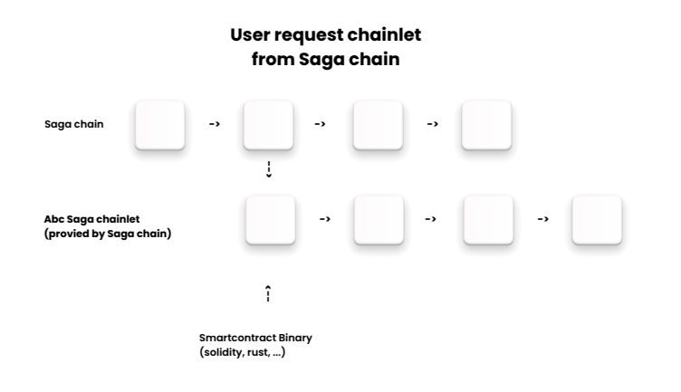

## Saga Protocol

Xin chào mọi người! Hôm nay, trong bài học này, mình sẽ giới thiệu đến các bạn một nền tảng mới thú vị có tên là Saga Protocol. Nền tảng này cho phép người dùng tự xây dựng blockchain mà không cần kiến thức lập trình sâu sắc, tạo điều kiện thuận lợi cho việc phát triển hệ sinh thái blockchain riêng của mỗi người. 🌐

Tại sao lại chọn Saga Protocol?
- Nếu bạn từng nghĩ rằng việc tạo riêng cho mình một blockchain là một việc rất phức tạp và tốn kém thì giờ đây với Saga Protocol, điều đó hoàn toàn có thể trở thành hiện thực một cách dễ dàng hơn bao giờ hết.
- Bạn không còn phải lo lắng về việc tự mình xây dựng các nút (node) hay các quá trình phức tạp khác. Saga Protocol sẽ giúp bạn làm điều đó mà không cần phải tốn quá nhiều công sức.

Các tính năng nổi bật của Saga Protocol
1. **Không cần kiến thức lập trình**: Saga Protocol hướng đến đối tượng người dùng không có kiến thức lập trình chuyên sâu. Bạn có thể dễ dàng tạo cho mình một blockchain chỉ với vài thao tác đơn giản.
2. **Giảm thiểu chi phí**: Saga Protocol cung cấp cho bạn các giải pháp như các validator và explorer mà không cần phải xây dựng chúng từ đầu, giúp tiết kiệm thời gian và chi phí đáng kể.
3. **Hỗ trợ EVM**: Nền tảng này hỗ trợ Ethereum Virtual Machine (EVM), cho phép bạn chạy các smart contract bằng ngôn ngữ lập trình phổ biến hiện nay.
4. **Tính năng giao dịch linh hoạt**: Saga Protocol cho phép bạn giao dịch nhiều loại tài sản số như token và NFT thông qua tính năng Saga Liquidity.

Cách hoạt động của Saga Protocol

- Để bắt đầu, người dùng sẽ yêu cầu một cổng (chain) trên mạng lưới của Saga. 
- Sau khi đã tạo, bạn có thể tương tác on-chain mà không cần phải thông qua mạng lưới Saga. Điều này giúp tiết kiệm được thời gian và tài nguyên.

Hướng dẫn sử dụng Saga Protocol
Có hai phương thức để bạn có thể tương tác với Saga Protocol:
1. **Giao diện người dùng (UI)**: Bạn có thể truy cập vào tài liệu hướng dẫn tại [https://docs.saga.xyz/](https://docs.saga.xyz/) và làm theo hướng dẫn để tạo tài khoản.
2. **Command Line Interface (CLI)**: Cho những ai thích làm việc trong môi trường dòng lệnh, Saga cũng cung cấp hướng dẫn chi tiết để tải CLI và bắt đầu làm việc với blockchain.

- Để sử dụng tính năng này, bạn chỉ cần cài đặt ví hỗ trợ như KEPLR. 
- Sau khi cài đặt, bạn sẽ được cung cấp một seed file và bắt đầu tạo tài khoản.

Khi bạn quyết định xây dựng một hệ sinh thái blockchain, điều quan trọng là phải xác định ngân sách. 
- Chi phí có thể giao động từ vài chục nghìn đến vài trăm nghìn đô, tùy thuộc vào quy mô và các mục tiêu mà bạn đặt ra. 
- Việc sử dụng Saga Protocol không chỉ giúp giảm bớt chi phí mà còn tạo điều kiện thuận lợi cho việc phát triển hiệu quả hơn. 

Nếu bạn cảm thấy bài viết này hữu ích, hãy chia sẻ với bạn bè và tham gia khoá học để cùng khám phá những khả năng mới từ Saga Protocol!
