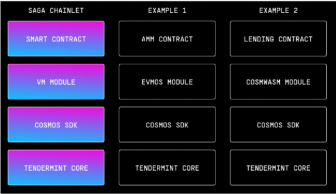
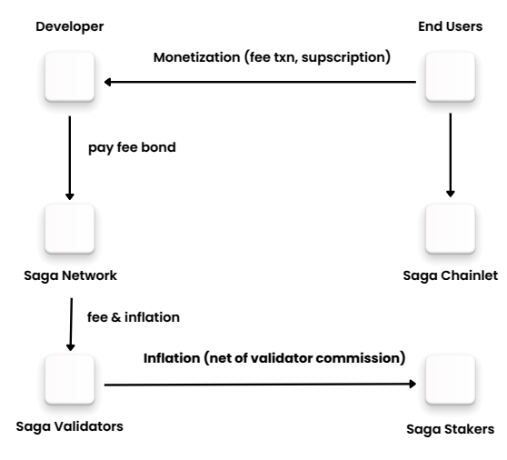

## Tổng quan về Chainlet trên Saga Protocol

Chào mọi người! Trong bài học này, chúng ta sẽ tìm hiểu về khái niệm Chainlet trong Saga Protocol. 

### Chainlet là gì?
Chainlet là một phần mở rộng của Saga Protocol, cho phép người dùng tạo ra các blockchain nhỏ hơn, gọi là chainlet, mà vẫn giữ được tính năng và khả năng tương tác với các blockchain khác. Điều này giúp cho việc phát triển và triển khai các ứng dụng blockchain trở nên linh hoạt và dễ dàng hơn.

### Vai trò của Chainlet
Chainlet đóng vai trò như một cầu nối giữa các ứng dụng và blockchain chính. Nó cho phép người dùng tùy chỉnh và tối ưu hóa các tính năng mà họ cần mà không cần phải xây dựng một blockchain hoàn chỉnh từ đầu. Điều này không chỉ tiết kiệm thời gian mà còn giảm thiểu chi phí phát triển.

### Cách thức hoạt động của Chainlet
1. **Tạo Chainlet**: Người dùng có thể tạo một chainlet mới thông qua giao diện người dùng hoặc CLI, tùy thuộc vào sở thích của họ.
2. **Tương tác với Chainlet**: Sau khi chainlet được tạo, người dùng có thể tương tác với nó thông qua các smart contract hoặc các giao thức khác mà Saga Protocol hỗ trợ.
3. **Kết nối với các blockchain khác**: Chainlet có khả năng kết nối và tương tác với các blockchain khác, cho phép người dùng tận dụng các tài nguyên và dịch vụ từ nhiều nguồn khác nhau.

### Mô hình hoạt động của Chainlet

#### Chi phí duy trì Chainlet
Nhà phát triển chainlet chỉ cần đóng tiền duy trì chainlet của họ hằng tháng. Phí duy trì này sẽ đảm bảo rằng chainlet của họ hoạt động liên tục và ổn định.

#### Phí giao dịch
Nhà phát triển có thể lựa chọn giao dịch trên mạng của họ tính phí theo giao dịch. Phí giao dịch sẽ chảy về tài khoản được chỉ định, giúp nhà phát triển có thể quản lý tài chính và thu hồi chi phí phát sinh từ việc duy trì chainlet.

- **Lợi ích**: Điều này không chỉ giúp nhà phát triển có nguồn thu nhập từ các giao dịch mà còn tạo động lực cho việc phát triển và cải tiến chainlet của họ.
- **Tùy chọn linh hoạt**: Nhà phát triển có thể điều chỉnh mức phí giao dịch tùy theo nhu cầu và chiến lược kinh doanh của họ.

Hãy cùng khám phá và thực hành với Chainlet để hiểu rõ hơn về cách mà nó có thể giúp bạn trong việc phát triển ứng dụng blockchain của riêng mình!
