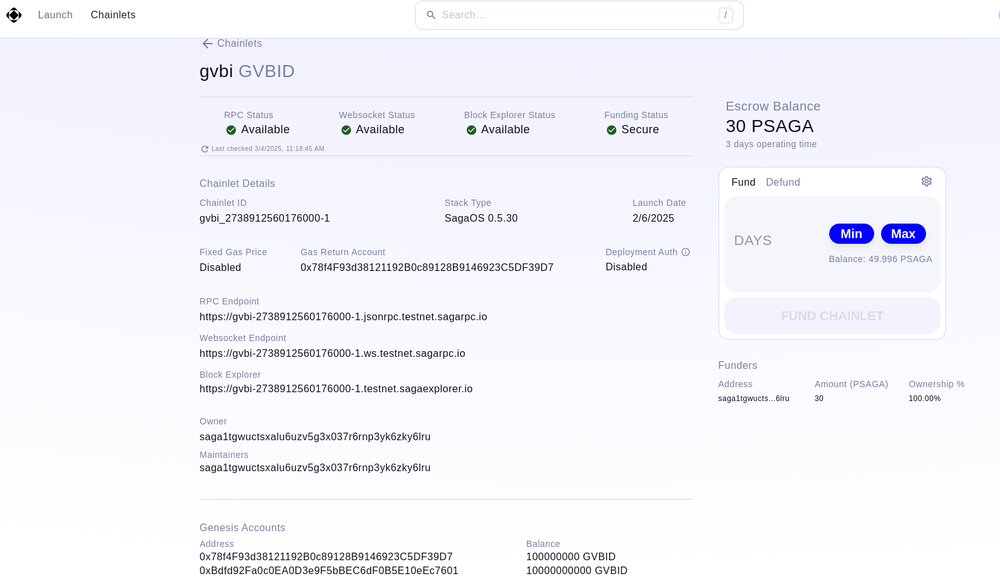

## Khởi chạy Chainlet trên Saga Protocol

Trong bài học trước, chúng ta đã tìm hiểu về khái niệm Chainlet trong Saga Protocol. Chainlet là một phần mở rộng của Saga Protocol, cho phép người dùng tạo ra các blockchain nhỏ hơn, gọi là chainlet, mà vẫn giữ được tính năng và khả năng tương tác với các blockchain khác. Chúng ta cũng đã khám phá vai trò của Chainlet như một cầu nối giữa các ứng dụng và blockchain chính, cùng với cách thức hoạt động của nó, bao gồm việc tạo chainlet, tương tác với chainlet và kết nối với các blockchain khác. Bài học này sẽ tiếp tục hướng dẫn bạn cách khởi chạy Chainlet trên Saga Protocol, giúp bạn áp dụng những kiến thức đã học vào thực tiễn.

### Khởi chạy Chainlet trên Saga Testnet (UI)

1. Đầu tiên bạn sẽ cần có ví Keplr, hãy truy cập vào https://www.keplr.app/ để tải về và cài đặt vaf tao cho minh mot tai khoan

2. Truy cap vao Saga testnet tai https://testnet.app.saga.xyz/

3. Khi chúng ta muốn khởi chạy một chainlet của mình lên, thì cần phải có token từ phía Saga cung cấp. Các bạn có thể gửi yêu cầu qua kênh chat của VBI, mình sẽ lên danh sách và gửi cho phía bên Saga.

4. Bạn sẽ cần điền một số trường thông tin như sau:
   - **Tên Chainlet**: Nhập tên cho chainlet của bạn.
   - **Token sử dụng trên Chainlet**: Chọn token mà bạn muốn sử dụng cho chainlet.
   - **Số ngày duy trì Chainlet**: Nhập số ngày mà bạn muốn duy trì chainlet.
   - **Địa chỉ Genesis EVM Account**: Cung cấp địa chỉ cho tài khoản Genesis EVM.
   - **Số lượng token cho tài khoản Genesis này**: Nhập số lượng token mà bạn muốn cấp cho tài khoản Genesis.

5. Sau khi launch thành công, chúng ta sẽ thấy một giao diện tương tự như này, có một số thông tin quan trọng chúng ta cần biết là RPC chainlet và explorer API. Đây sẽ là hai đầu API quan trọng để bạn thiết lập mạng trên MetaMask.

### Quản lý Chainlet

Sau khi đã khởi chạy chainlet thành công, bạn cần biết cách quản lý và theo dõi chainlet của mình. Dưới đây là một số bước để quản lý chainlet:

1. **Theo dõi trạng thái Chainlet**: Bạn có thể kiểm tra trạng thái hoạt động của chainlet thông qua giao diện người dùng. Điều này giúp bạn nắm bắt được tình hình hoạt động và xử lý kịp thời nếu có vấn đề xảy ra.

2. **Cập nhật thông tin Chainlet**: Nếu bạn cần thay đổi thông tin của chainlet, hãy truy cập vào phần quản lý chainlet và thực hiện các thay đổi cần thiết. Bạn có thể cập nhật tên, token sử dụng, hoặc số ngày duy trì.

3. **Xóa Chainlet**: Nếu bạn không còn cần chainlet nữa, bạn có thể xóa nó thông qua giao diện quản lý. Hãy chắc chắn rằng bạn đã sao lưu tất cả dữ liệu quan trọng trước khi thực hiện thao tác này.

4. **Liên hệ hỗ trợ**: Nếu bạn gặp khó khăn trong quá trình quản lý chainlet, hãy liên hệ với đội ngũ hỗ trợ của Saga để được trợ giúp kịp thời.

### Cài đặt trên MetaMask

1. Truy cap vao vi metamask va chon setting network
2. Nhấn vào "Add Network" và điền thông tin sau:
   - **Tên mạng**: Nhập tên cho mạng chainlet của bạn.
   - **RPC URL**: Nhập địa chỉ RPC chainlet mà bạn đã nhận được.
   - **Chain ID**: Nhập Chain ID của chainlet.
   - **Symbol**: Nhập ký hiệu token mà bạn đã chọn cho chainlet.
   - **Block Explorer URL**: Nhập địa chỉ explorer API nếu có.

3. Sau khi điền xong, nhấn "Save" để lưu lại cài đặt mạng. Bạn sẽ thấy mạng chainlet của mình trong danh sách mạng của MetaMask.

Hãy đảm bảo rằng bạn đã cài đặt MetaMask và kết nối với chainlet của mình để đảm bảo hoạt động hiệu quả và ổn định!
